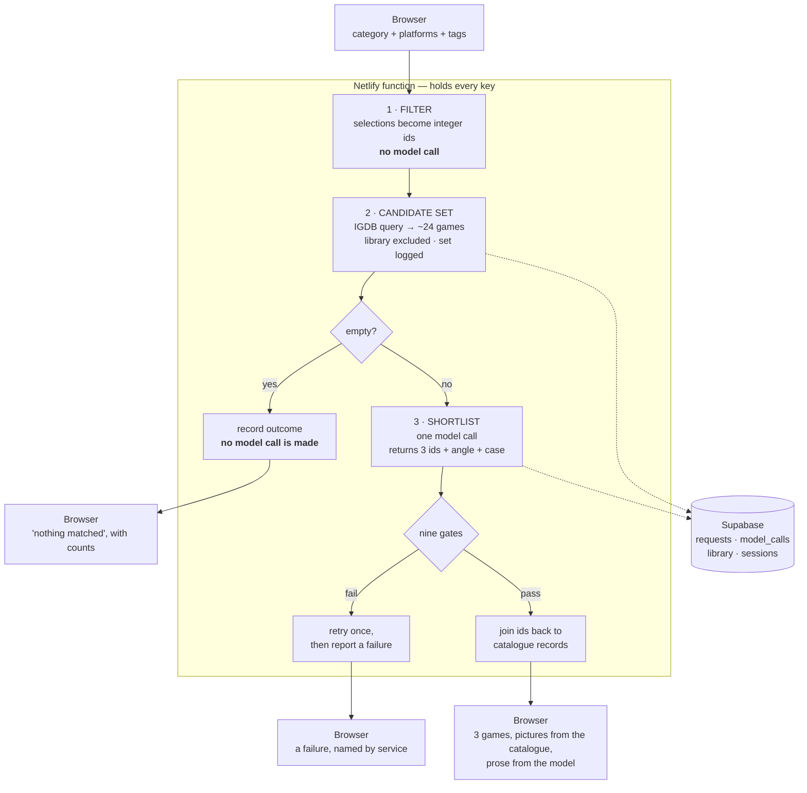
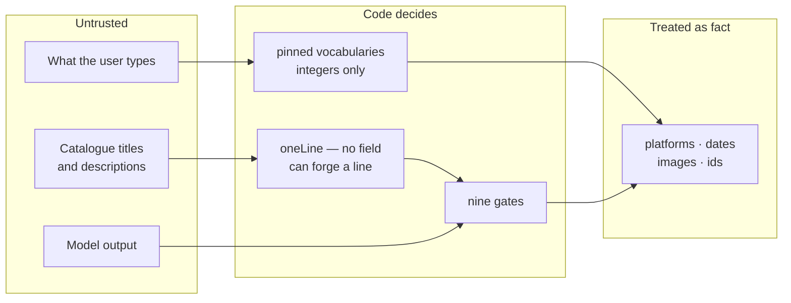

# Architecture

One page on how Throughline is put together and why. Written in turn 021,
because twenty turns of decision records and turn logs did not add up to a place
you could see the shape of the thing.

`docs/spec.md` is the authority on **what** gets built. This says **how the parts
sit together**. Where they disagree, the specification wins.

---

## The one idea

**The model may only choose from the set it was given, and code verifies every id
came back from that set.**

Everything below is machinery for that sentence. A model asked for game
recommendations from memory will state that a game is on a platform it never
shipped on, fluently and with no way to catch it. Here the model writes the
argument and code decides what it is allowed to argue about.

---

## The request, end to end

Three things about that diagram matter more than the boxes:

**Step 1 makes no model call.** Filtering is pure code over pinned integer ids,
so it is testable with no key and no cost. 292 offline checks exist because of
this choice.

**Step 2 logs the whole candidate set** before anything sees it. Criterion 7.
Without it, "the model recommended something odd" and "the filter excluded the
right answer" are indistinguishable after the fact.

**The empty path never reaches the model.** Proven by the absence of a
`model_calls` row, not by the message on screen — a screen saying nothing ran is
not evidence that nothing ran.

---

## The nine gates

Every one runs server-side on the model's response. Any failure is a failed
response, retried once, then reported as a failure — never a partial shortlist.

| # | Gate | Criterion | Why it exists |
|---|---|---|---|
| 1 | Exactly three picks, or the candidate count if fewer | 5 | A thin result is never padded |
| 2 | **Every id was in the candidate set** | 2 | The rule the design rests on |
| 3 | No game appears twice | 2 | The pressure to fill three slots produces duplicates |
| 4 | Every game is on a selected platform | 3 | Per the catalogue, never per a claim in the case |
| 5 | Every game carries the selected category | 4 | Same |
| 6 | Every game carries at least one selected tag | 4a | The wording matters: *the catalogue says* it carries the tag |
| 7 | Every angle is in the fixed vocabulary, and used once | 6 | A free-text reason would pass on "atmospheric" and "very atmospheric" |
| 8 | **Each angle's own condition holds against the data** | 6 | `acclaimed-one` needs the score and the review count to actually be there — `angleFits` in `src/shortlist.js` |
| 9 | Every tag note names a tag that was asked for, that the catalogue lists, and names it once | 4a | The model explaining a tag the game does not have |

Gate 8 is the one most easily mistaken for gate 7. Seven proves the *label* is
legal; eight proves the *claim behind the label* is supported by the catalogue
record. A shortlist can pass seven and fail eight by calling a 62-rated game the
acclaimed one.

Gate 2 is the load-bearing one. If a returned id is not in the set, that is a
failure, not an interesting suggestion — it is never looked up and included.

---

## Modules

| File | Holds |
|---|---|
| `src/source.js` | **The catalogue switch.** One line. Everything routes through it. |
| `src/igdb-catalogue.js` | Steps 1 and 2 against IGDB: query building, shaping, ranking, exclusion |
| `src/igdb.js` | Transport only: Twitch token, 4-per-second limiter, image URLs |
| `src/catalogue.js` | The RAWG module. Superseded; still passes its checks. Deleted once IGDB is deployed and proven. |
| `src/shortlist.js` | Step 3: the prompt, the call, the nine gates, `formatCandidate` |
| `src/pipeline.js` | Joins the three steps and records every outcome, including the ones with no model call |
| `src/store.js` | Supabase, via PostgREST. The service key lives here and nowhere near the browser. |
| `src/deals.js` · `src/events.js` · `src/suggested.js` · `src/home.js` | The four front-page rows |
| `src/detail.js` | One game in full, when a card is opened |
| `src/budget.js` · `src/callLog.js` · `src/config.js` | Spend cap, call log, secrets |

### Why `src/source.js` exists

Two catalogue modules export the same nine names. `src/source.js` re-exports one
of them, so swapping catalogues is a legible one-line commit rather than a
rewrite of nine files' imports.

**It is not free, and turn 020 measured the cost.** The nine names match; the
*contract* does not — `assembleCandidates` takes `platformIds` in the RAWG module
and `machineSlugs` here. So the swap is one line **plus its caller**. Both modules
validate their arguments and throw, so a mis-shaped call crashes rather than
silently returning games filtered by nothing.

Turn 020 also found two command-line scripts that had never gone through the
switch at all, and had been answering from RAWG for five turns without failing.

---

## Where the trust boundaries are

**Catalogue text is attacker-controlled.** Titles come from a third party, nobody
in this project chose them, and they go into the prompt. Reference case 5 put five
injected instructions into a title: zero compliance, but one *forged two catalogue
fields into the prompt* through a newline. Fixed in code — `oneLine` in
`src/shortlist.js` — because the model ignoring it was luck, not a control.

**Genres are claims, not facts.** IGDB files Breath of the Wild under `puzzle`. A
gate proves the catalogue says something and nothing more. Platforms and dates
are facts; everything else the catalogue says is a claim.

**Nothing the model returns is trusted except the id.** Titles, pictures,
platforms and dates on the finished card all come from the catalogue record the
id joins back to.

---

## What this architecture does not do

**There is no rate limiting** on `/api/shortlist`, `/api/deals` or `/api/event`.
The deployed endpoints spend OpenRouter credit for anyone who finds them,
bounded only by the prepaid balance.

**It is not RAG.** There are no embeddings, no vector store, no similarity
search. Retrieval is a database query over pinned integer ids. The difference
that matters is what happens after retrieval: typical RAG puts chunks in the
prompt and hopes the model grounds its answer in them, with nothing checking.
Here the retrieved set is a closed set of ids and code verifies every id came
back from it.

---

## External services

| Service | For | Failure costs |
|---|---|---|
| IGDB (via Twitch) | The catalogue. 4 req/sec, ~57-day token. | Everything |
| OpenRouter | One model call per request | The shortlist only; the front page still works |
| IsThereAnyDeal | Prices. 1,000 req / 5 min. | One front-page row, which reports itself |
| Supabase | Records, library, freshness | Loud, on the page — never a silent skip |

Each carries its own failure `kind`, because criterion 13 stops being decoration
once there is more than one service and a user has to say which one broke.

---

## Reading order for someone new

1. `CLAUDE.md` — the standing brief
2. `docs/spec.md` — the specification, v3.1
3. `docs/failures.md` — thirty-two failures, one line each. **Most of the value
   in this repository is here.**
4. `docs/decisions/` — the forks that could have gone another way
5. This file
6. `src/pipeline.js`, then `src/shortlist.js`
